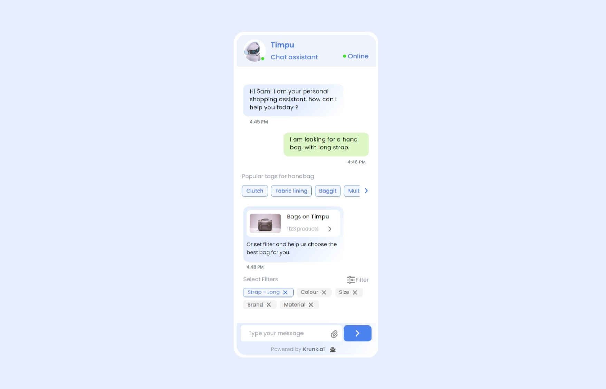

# Website Development React Project



## Project Overview

This repository contains a React website, mirroring the design provided in the Figma file linked below. The design link can be accessed [here](https://www.figma.com/file/2W9PMqczURRpYnMiUhYKTM/Krunk-assignment?type=design&node-id=0%3A1&mode=design&t=zsrFKruHRIoiMidU-1).

## Live Demo

Check out the live demo of the project [here](https://wdvproject.netlify.app/).

## Getting Started

To run this project locally, follow these steps:

1. Clone the repository to your local machine:

```
git clone https://github.com/rahulkumar-yadav/wdvproject.git
```

2. Navigate to the project directory:

```
cd wdvproject
```

3. Install dependencies:

```
npm install
```

4. Run the development server:

```
npm run dev
```

This will start the development server, and you can view the webpage by accessing http://localhost:3000 in your browser.

Thank you for checking out my project!
